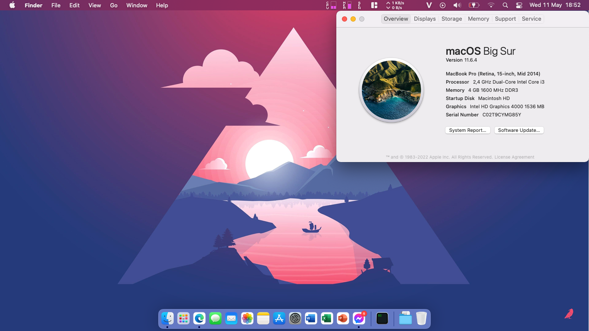
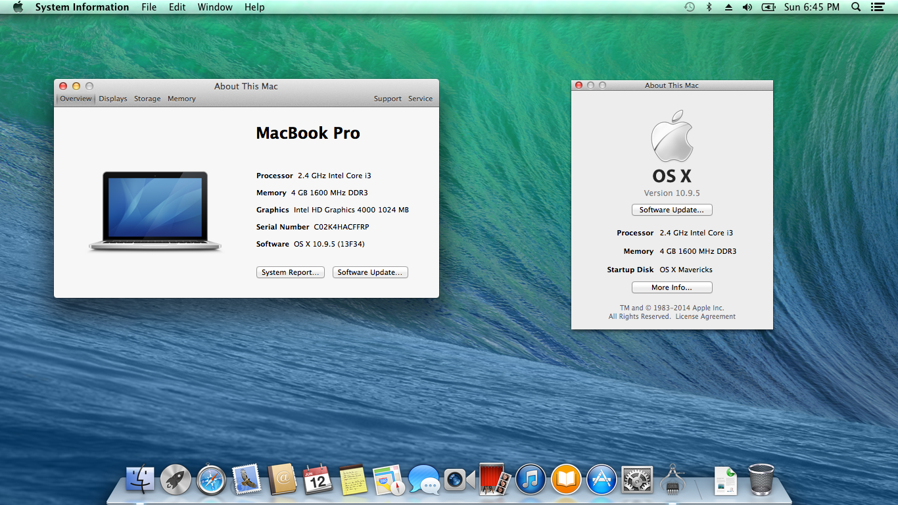
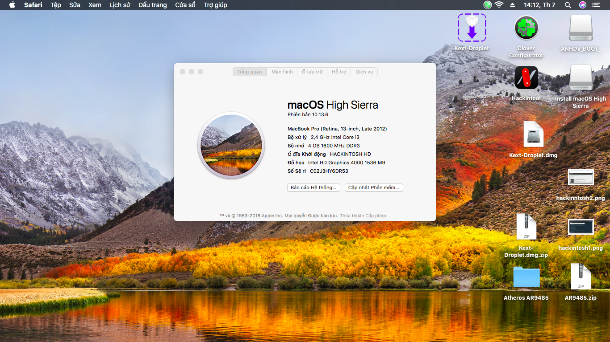
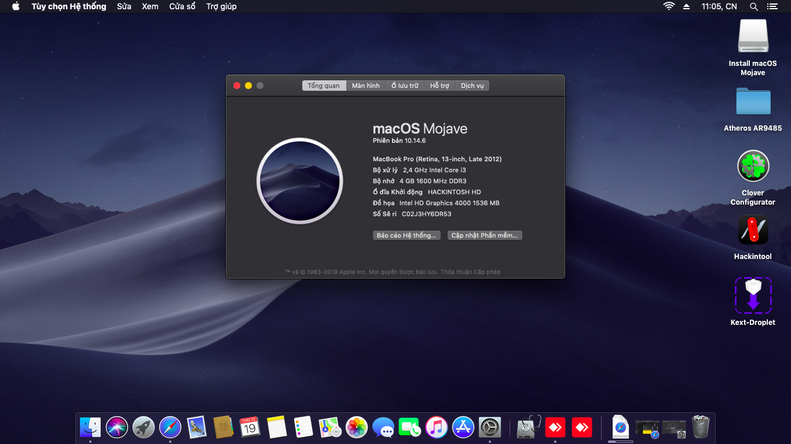
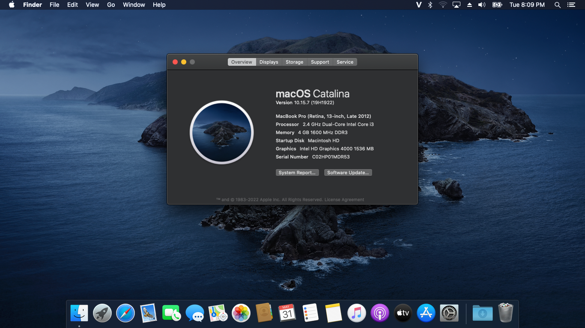
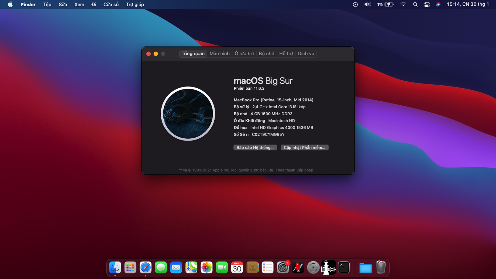
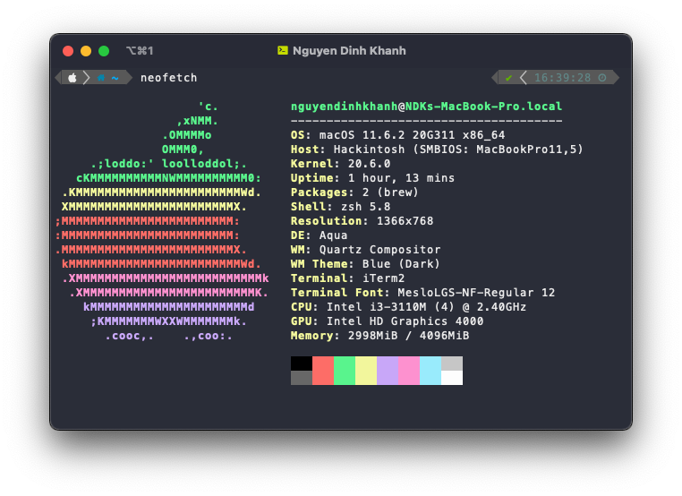
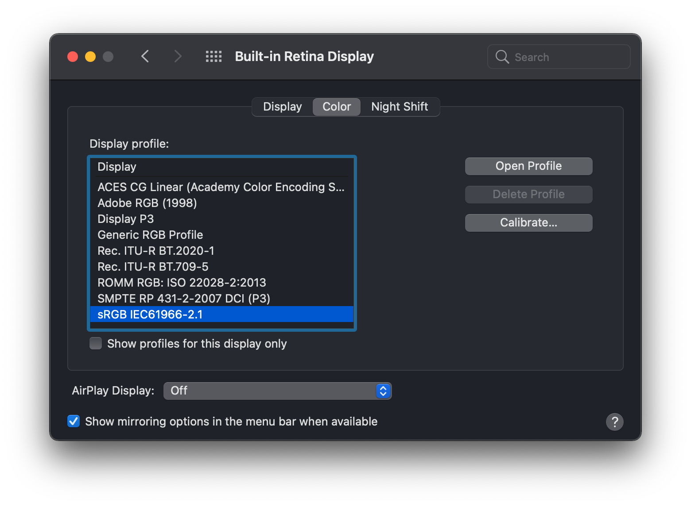
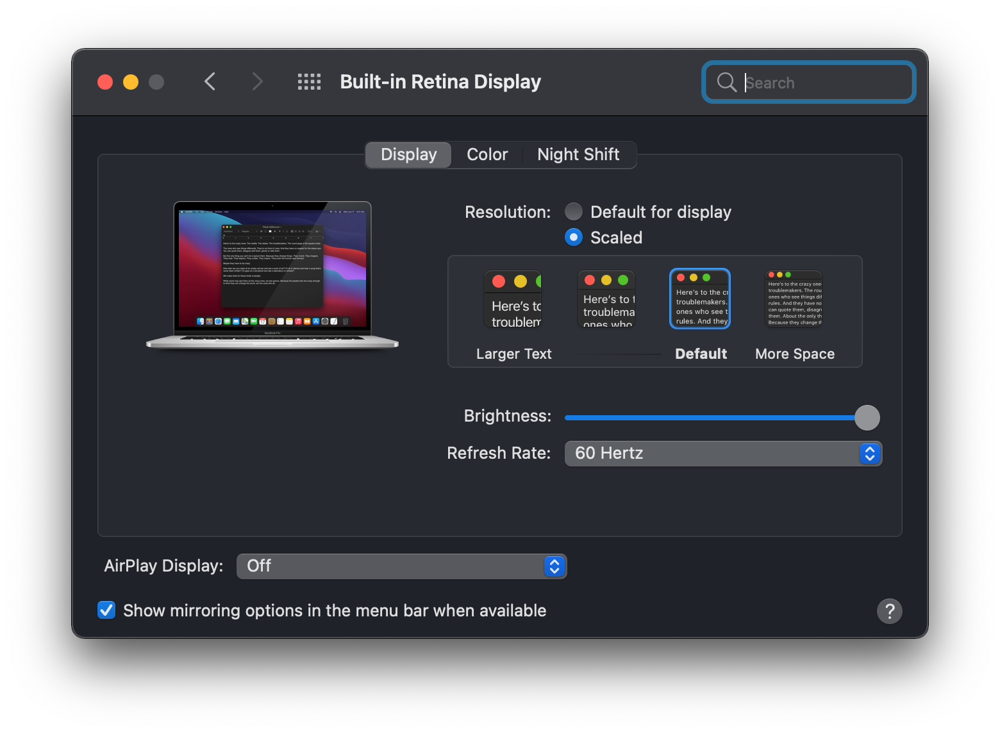

# <div align="center">Dell Vostro 3460 Hackintosh</div>
## Phiên Bản Bootloader

|OpenCore|Clover|
|--------|------|
|0.8.2|5146| 

## Các Bản macOS (OS X) Hỗ Trợ
- Mavericks
- Yosemite
- El Capitan
- Sierra
- High Sierra
- Mojave
- Catalina
- Big Sur (⚠️ Dùng SMBIOS ```MacBookPro11,1```)
- Monterey (chỉ OpenCore)
## Ảnh Chụp Màn Hình

<div align="center">
  

   
</div>
<details>
		<summary>Các OS khác</summary>
      <br>
  





  
</details>

## Thông Tin Laptop
 
|                     | Thông tin chi tiết | Ghi chú |
| ---------------------------- | ---------------------- |------------------|
| ``Chipset``| Intel Panther Point |   |
| ``CPU``| Intel Core i3-3110M 2.40GHz | Dùng [HFSPlusLegacy.efi](https://github.com/acidanthera/OcBinaryData/blob/master/Drivers/HfsPlusLegacy.efi) |
| ``Bộ nhớ``| 8GB DDR3-1600MHz | 2 x 4GB DDR3 và DDR3L. |
| ``iGPU``| Intel HD Graphics 4000 | Patch with [Patch-HD4000-Monterey](https://github.com/chris1111/Patch-HD4000-Monterey) tạo bởi [chris1111](https://github.com/chris1111) trong Monterey. |
| ``dGPU``| NVIDIA GeForce GT 630M | Chỉ có ở phiên bản i5-3210M. |
| ``Ổ lưu trữ 0``| SSD Lexar NS100 128GB | Dualboot Windows và macOS. |
| ``Ổ lưu trữ 1``| HDD HGST HTS725050A7E630 500GB | Dùng lưu dữ liệu. |
| ``Màn hình``| 14.0" 1366 x 768 |    |
| ``Ethernet``| Qualcomm Atheros AR8161 | Dùng [AtherosE2200Ethernet](https://github.com/Mieze/AtherosE2200Ethernet/releases/tag/2.2.2). |
| ``WiFi và Bluetooth``| Intel® Dual Band Wireless-AC 7260 | (Thay thế từ AR9485). Dùng [AirportItlwm](https://github.com/OpenIntelWireless/itlwm/releases) cho Wifi và [IntelBluetoothFirmware](https://openintelwireless.github.io/IntelBluetoothFirmware/) cho Bluetooth. | 
| ``Âm thanh``| Conexant Cx20590 | Thêm `alcid=14` trong boot-arg hoặc vào DeviceProperties. |
| ``Bàn phím``| - | Yêu cầu patch SSDT cho phím tăng giảm độ sáng. |
| ``Touchpad``| Dell Touchpad (ALPS, PS/2) | Dùng [VoodooPS2-ALPS](https://github.com/SkyrilHD/VoodooPS2-ALPS/releases/tag/1.0.7). |
| ``Kích thước``| 30mm x 345.5mm x 244mm |     |
|``Cân nặng``| 2.23kg |     |
  
<div align="center">
  

  
</div>

## Các Tính Năng Đã Hoạt Động


|                               | OpenCore             | Clover|
| ----------------------------- | -------------------- | ------------------|
| ``Wifi và Bluetooth``|✅|✅|
| ``Âm Thanh``|✅|✅|
| ``Bàn Phím và Trackpad``|✅|✅|
| ``Cổng Headphone``|✅|✅|
| ``Card Màn Hình``|✅|✅|
| ``Pin``|✅|✅|
| ``Quản Lí Năng Lượng``|✅|✅|
| ``Trackpad Đa Điểm``|✅|✅|                                                                          
| ``Webcam``|✅|✅|
| ``USB Port``|✅|✅|
| ``Facetime và iMessage``|✅|✅|
| ``Sleep``|✅|✅|
| ``Ethernet``|✅|✅|
| ``Hotkeys``|✅|✅|

```Ghi chú:``` Nếu Airportitlwm không thể khởi động ở Catalina và cũ hơn, hay sử dụng [kext](https://github.com/qilskcter/Dell-Vostro-3460-Hackintosh/tree/main/Kexts) này.

# Hướng Dẫn Cài Đặt Màn Hình
Sau khi cài xong, mở System Preferences và tìm Displays -> Color, bỏ check `Show profiles for this display only`, sau đó chọn `sRGB IEC61966-2.1`, điều này sẽ làm cho màu sắc của bạn trông đúng hơn (chắc chắn không được hiệu chỉnh hoặc bất cứ điều gì, nhưng không phải là một mớ hỗn độn quá bão hòa).

<div align="center">
  


</div>

Nếu bạn muốn màn hình của mình giống real Mac thì bạn hãy dùng [one-key-hidpi](https://github.com/xzhih/one-key-hidpi) (không khuyến khích)

<div align="center">
  

  
</div>

# Dùng EFI Thế Nào ?
Tải bộ cài tại [HeaVietNam](https://heavietnam.github.io/image/index.html) (bộ cài recovery online vẫn hơn), sau đó dùng MiniTool or hoặc các phần mềm khác để mount EFI partition, sau đó sử dụng Explorer ++ để truy cập phân vùng EFI và sao chép nó vào thư mục EFI của bạn. Hãy nhớ thêm boot-options, sử dụng [EasyUEFI](https://www.easyuefi.com/index-us.html) hoặc bios.
# Cảm Ơn
- [Apple](https://apple.com) vì macOS.
- Acidanthera, SkyrilHD, USBToolBox, etc. vì tất cả các kext.
- [NLTD2010](https://github.com/NLTD2010) cho EFI của tôi và bản dịch tiếng Việt.
- [Olarila](https://olarila.com) vì EFI ăn liền (≧▽≦)
- [khanhmuy](https://github.com/khanhmuy) vì file README của tôi.
- [Võ Nguyễn HoangLong](https://www.facebook.com/profile.php?id=100070274020733) vì [HeaVietNam](http://heavietnam.ga/) guide.
- [Stijn Rombouts](https://www.facebook.com/stijn.rombouts2) vì đã giúp tôi fix một số thứ.
- [kleqing](https://github.com/kleqing) vì đã giúp tôi fix sleep trên Monterey.
