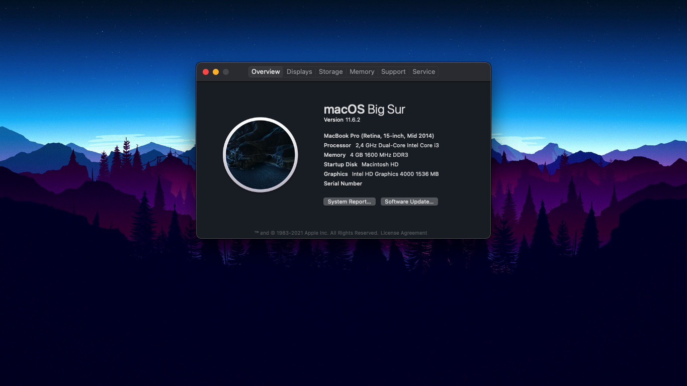

# You can download my EFI at [releases](https://github.com/qilskcter/Dell-Vostro-3460-Hackintosh/releases) tab or clone this Repo

# Dell Vostro 3460 Hackintosh (Using Clover and OpenCore) built by NLTD2010
## Supported macOS versions: High Sierra, Mojave, Catalina, Big Sur (OpenCore).
## Screenshots:

## Laptop specs:

|                                           | Specifications                                                                                                                                            |
| ----------------------------------------- | -------------------------------------- |
| ``Chipset``                               | Intel Ivy Bridge                       |                                                                                                                                               |                                                                                    |
| ``CPU``                                   | Intel Core i3-3110M                    |                                                                                                                        |                                                                                    |
| ``Memory``                                | 4GB DDR3-1600MHz, up to 8GB            |                                                                                                                    |                                                                                    |
| ``GPU``                                   | Intel HD Graphics 4000                 |                                                                                                                                               |                                                                                    |
| ``Storage``                               | HDD HGST HTS725050A7E630 500GB         |                                                                                                                        |                                                                                    |
| ``Screen``                                | 14.0" 1366 x 768                       |                                                                                                                                               |                                                                                    |
| ``Ethernet``                              | Qualcomm Atheros AR8161                |                                                                                                                                              |                                                                                    |
| ``WiFi and Bluetooth``                    | Qualcomm Atheros AR9485                |                                                                                |
| ``Audio``                                 | Conexant Cx20590                       |                                                                                                                                               |                                                                                    |
| ``Keyboard``                              | -                                      |                                                                                                                                               |                                                                                    |
| ``Touchpad``                              | Dell Touchpad (ALPS, PS/2)             |
| ``Dimensions`` ``Weight``              | 30mm x 345.5mm x 244mm 2.23kg       | 

## Features

|                               | OpenCore             | Clover                                                                                                                   |                                                
| ----------------------------- | -------------------- | ------------------           |
| ``Wifi and Bluetooth``        |      ✅              |       ✅                     |                                                                                                    |                                                                           |
| ``Audio``                     |      ✅              |       ✅                     |                                                                                                      |
| ``Keyboard and Trackpad``     |      ✅              |Not displayed Trackpad Setting|
| ``Headphone Jack``            |      ✅              |       ✅                     |                                                                           |
| ``Graphics``                  |      ✅              |       ✅                     |                                                                           |
| ``Battery``                   |      ✅              |       ❌                     |                                                                           |
| ``Native Power Management``   |      ✅              |       ✅                     |                                                                           |
| ``Multigesture Trackpad``     |      ✅              |       ✅                     |                                                                          
| ``Webcam``                    |      ✅              |       ✅                     |
| ``USB Port``                  |      ✅              |       ✅                     |
| ``Facetime and iMessage``     |      ✅              |       ✅                     |
| ``Sleep``                     |      ✅              |       ❌                     |                                                                           |
| ``Ethernet``                  |      ❌              |       ❌                     |

# How to use this EFI?
You download the macOS installer at [here](https://www.olarila.com/topic/6278-hackintosh-and-macintosh-olarila-vanilla-images-macos/), then use MiniTool or other software to mount EFI, then use Explorer++ to access the EFI partition and then copy it.
# How to fix Wifi and Bluetooth?
## On High Serria, Mojave , Catalina
- You go to Kext folder, you can see these kext: ATH9KInjector.kext, IO80211Family_ATH.kext, IOath3kfrmwr.kext
- Download Kext Droplet at [here](https://github.com/chris1111/Kext-Droplet) and then you put these kext in S/L/E (System/Library/Extensions) and Reboot.
- Or you can repelace it with another wifi card
## On Big Sur
- Keep using it
