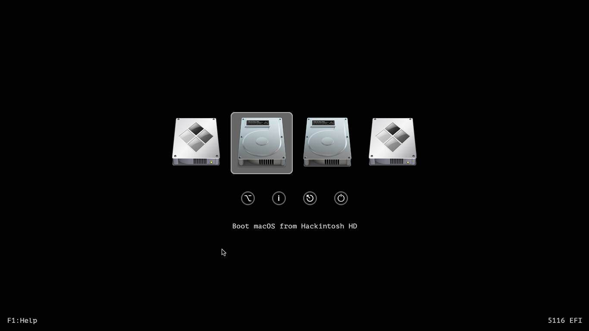

# You can download my EFI at [releases](https://github.com/qilskcter/Dell-Vostro-3460-Hackintosh/releases) tab or clone this Repo

# Dell Vostro 3460 Hackintosh (Using Clover and OpenCore)
## Supported macOS versions: High Sierra, Mojave, Catalina, Big Sur (OpenCore).
## Screenshots:

## Laptop specs:

- CPU: Intel Core i3-3110M
- RAM: 4GB
- Graphics: Intel HD4000 1366 x 768
- Wi-fi/Bluetooth card: Qualcomm Atheros AR9485
- Audio: Conexant Cx20590
- Ethernet: Qualcomm Atheros AR8161
- Hard Disk: HDD HGST HTS725050A7E630 500GB
## Working:
- Wifi 
- Audio
- Keyboard and Trackpad
- Headphone Jack
- Graphics
- Bluetooth
- Battery (OpenCore)
- Native Power Management
- Multigesture Trackpad (OpenCore)

## Not working:
- Ethernet
- Sleep
- Something...
## Issues
- Trackpad settings are not showing (because my computer's battery is dead only Clover).
# How to use this EFI?
You download the macOS Mojave installer at [here](https://drive.google.com/file/d/1i8QDEaajCXy9L56oh5sEavWZ52wi4JnZ/view), then use MiniTool or other software to mount EFI, then use Explorer++ to access the EFI partition and then copy it.
# How to fix Wifi and Bluetooth?
## On High Serria, Mojave , Catalina
- You go to Kext folder, you can see these kext: ATH9KInjector.kext, IO80211Family_ATH.kext, IOath3kfrmwr.kext
- Download Kext Droplet at [here](https://github.com/chris1111/Kext-Droplet) and then you put these kext in S/L/E (System/Library/Extensions) and Reboot.
- Or you can repelace it with another wifi card
