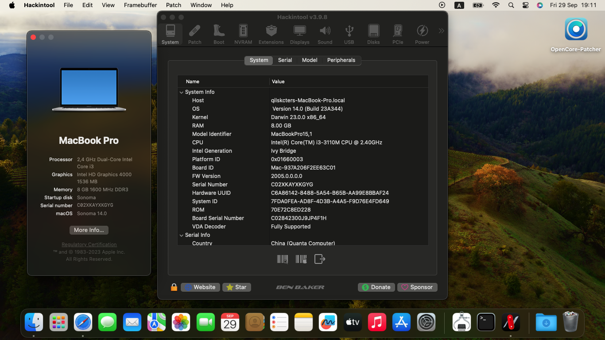
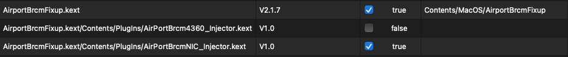
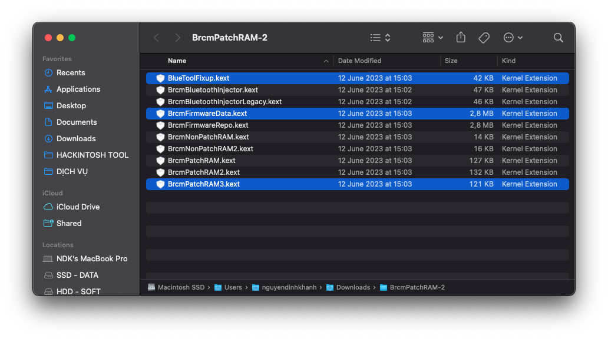
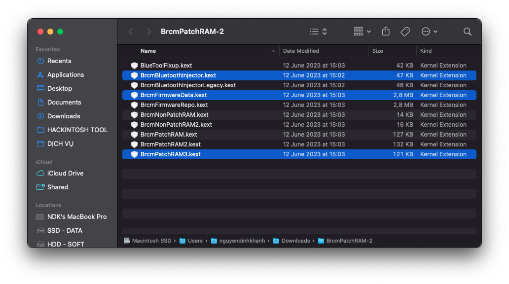
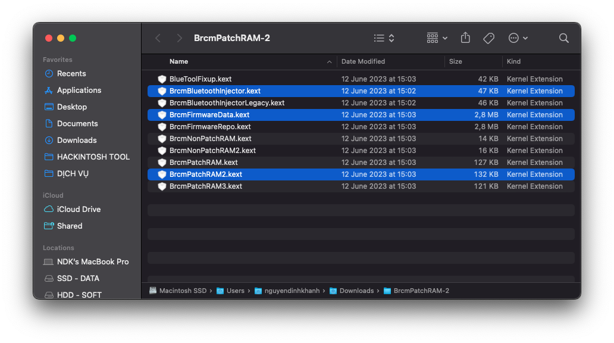
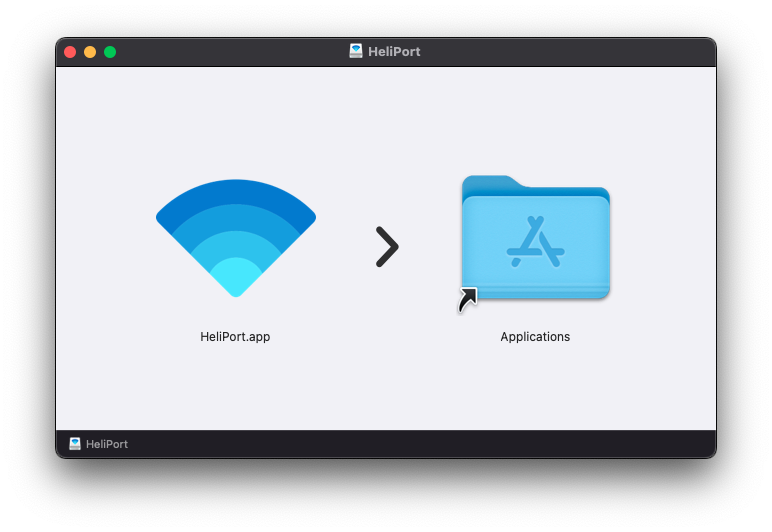

# Dell Vostro 3460 Hackintosh

[English](README.md) | [Tiếng Việt](README_vi.md) | [中国人](README_ch.md)

## Versions

### Bootloader

|OpenCore|Clover|
|--------|------|
|0.9.6|5146| 

### macOS

|Version|SMBios|
|-------|------|
|High Siera 
Mojave  
Catalina | ```MacBookPro9,2``` |
|Big Sur| ```MacBookPro11,1``` |
|Monterey| ```MacBookPro12,1``` |
|Ventura| ```MacBookPro14,1``` |
|Sonoma| ```MacBookPro15,1``` |

```Note:``` 
- When install macOS Ventura and Sonoma, using [CryptexFixup](https://github.com/acidanthera/CryptexFixup/releases) to bypass AVX2.0 sytem requirement.


## Screenshots

<div align="center">
  

   
</div>


## Laptop Specification
 
|                     | Specifications|
| ---------------------------- | ---------------------- |
| ``Chipset``| Intel Panther Point |
| ``CPU``| Intel Core i3-3110M / i5-3210M / i7-3612QM | 
| ``Memory``| 8GB DDR3-1600MHz |
| ``iGPU``| Intel HD Graphics 4000 | 
| ``dGPU``| NVIDIA GeForce GT 630M | 
| ``Storage``| 2,5" SATA DISK | 
| ``Card Reader``| Realtek RTS5129 | 
| ``Fingerprint`` | Synaptics FP Sensors |
| ``Screen``| 14.0" 1366 x 768 |
| ``Ethernet``| Qualcomm Atheros AR8161 |
| ``WiFi and Bluetooth``| Intel® Dual Band Wireless-AC 7260 <br> Broadcom BCM94352HMB |
| ``Audio``| Conexant Cx20590 | 
| ``Keyboard``| - | 
| ``Touchpad``| Dell Touchpad (ALPS, PS/2) |
| ``Battery``| 48Wh 6-cell lithium ion |
| ``Dimensions``| 30mm x 345.5mm x 244mm |
| ``Weight``| 2.23kg |
  
## What Working ?

- [x] Wifi and Bluetooth
- [x] Audio
- [x] Keyboard and Trackpad
- [x] Headphone Jack
- [x] Graphics
- [x] Battery
- [x] Card Reader
- [x] Power Management
- [x] Multigesture Trackpad  
- [x] Webcam
- [x] USB Ports
- [x] Facetime and iMessage
- [x] Sleep
- [x] Ethernet
- [x] Hotkeys

# Installing
## Download macOS Installer
### Offline Installer
- Download the macOS installer from [Olarila](https://www.olarila.com/topic/6278-olarila-vanilla-images-macos-installer/), after that, use [Balena Etcher](https://etcher.balena.io) to flash a .raw file into your USB.
- Using [MiniTool](https://www.partitionwizard.com) to mount USB's EFI Partition.
- Using [Explorer++](https://explorerplusplus.com/download) to access EFI Partition.
- Download my EFI at [Release Page](https://github.com/qilskcter/Dell-Vostro-3460-Hackintosh/releases), and copy it to EFI Partition.
### Online Recovery
- Follow [Dortania's OpenCore Install Guide](https://dortania.github.io/OpenCore-Install-Guide/installer-guide/windows-install.html) to create macOS Recovery.
- Download my EFI at [Release Page](https://github.com/qilskcter/Dell-Vostro-3460-Hackintosh/releases), and copy it to your USB.
# Post-Install
## Fixing Wifi and Bluetooth
### Broadcom
``Wifi``
- Download [AirportBrcmFiup](https://github.com/acidanthera/AirportBrcmFixup/releases) and copy ``AirportBrcmFixup.kext`` to ```\EFI\OC\Kext``` (Remember to add it in config.plst) or ```\EFI\CLOVER\Kext\Other```.
-  Reboot and enjoy.

```Note: ```
- When using kext AirportBrcmFixup in macOS Big Sur and newer, you need to remove the ```AirPortBrcm4360_Injector``` kext plugin



``Bluetooth``

- Download [BrcmPatchRAM](https://github.com/acidanthera/BrcmPatchRAM/releases).
- Using these kexts base-in your macOS version and copy it 

```Monterey and Ventura```



```Catalina and Big Sur```



```High Sierra and Mojave```



### Intel
``Wifi``

```Using Itlwm```
- Download [Itlwm](https://github.com/OpenIntelWireless/itlwm/releases) and [HeliPort](https://github.com/OpenIntelWireless/HeliPort/releases), copy ``Itlwm.kext`` to ```\EFI\OC\Kext``` (Remember to add it in config.plst) or ```\EFI\CLOVER\Kext\Other```.
- Reboot your system and install HeliPort.app to access networks by drag and drop into Application Folder.



```Using AirportItlwm```

- Download [AirportItlwm](https://github.com/OpenIntelWireless/itlwm/releases), copy ``AirportItlwm.kext`` to ```\EFI\OC\Kext``` (Remember to add it in config.plst) or ```\EFI\CLOVER\Kext\Other```.
- Reboot and enjoy.

``Bluetooth``

```Monterey and Ventura```

- Download [BrcmPatchRAM](https://github.com/acidanthera/BrcmPatchRAM/releases) and [IntelBluetoothFirmware](https://github.com/OpenIntelWireless/IntelBluetoothFirmware/releases).
- In BrcmPatchRAM folder, use only ``BluetoolFixup.kext`` and copy  to ```\EFI\OC\Kext``` (Remember to add it in config.plst) or ```\EFI\CLOVER\Kext\Other```.
- In IntelBluetoothFirmware folder, remove ``IntelBluetoothFirmwareInjector.kext`` and copy  to ```\EFI\OC\Kext``` (Remember to add it in config.plst) or ```\EFI\CLOVER\Kext\Other```.

```Big Sur and Older```

- Download [IntelBluetoothFirmware](https://github.com/OpenIntelWireless/IntelBluetoothFirmware/releases) and copy all kext inside to ```\EFI\OC\Kext``` (Remember to add it in config.plst) or ```\EFI\CLOVER\Kext\Other```.


# Thanks
- [Apple](https://apple.com) for macOS.
- Acidanthera, SkyrilHD, USBToolBox, etc. for all the kext.
- [NLTD2010](https://github.com/NLTD2010) and [Olarila](https://olarila.com) for my EFI folders.
- [khanhmuy](https://github.com/khanhmuy) for my README file.
- [Võ Nguyễn HoangLong](https://www.facebook.com/profile.php?id=100070274020733).
- [Stijn Rombouts](https://www.facebook.com/stijn.rombouts2) for help me fixed something.
- [kleqing](https://github.com/kleqing) for help me fixed sleep in Monterey.
