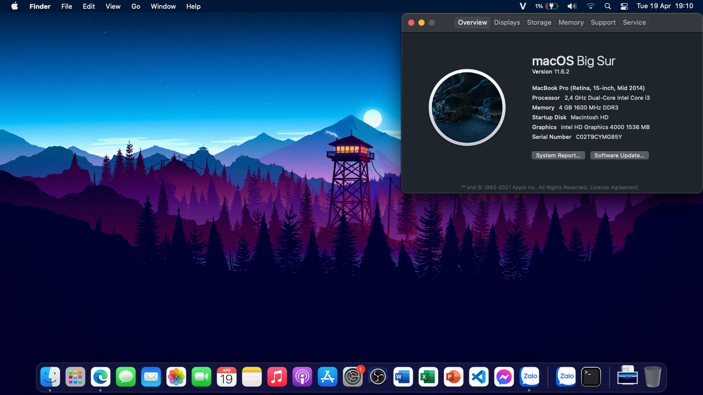
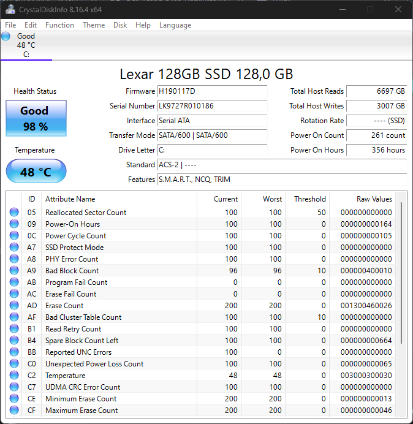

# <div align="center">Dell Vostro 3460 Hackintosh</div> 
## Bootloader versions
|OpenCore|Clover|
|--------|------|
|0.7.7|5116|
|0.7.8 Beta|5139|
|0.7.9 Beta|-|
|0.8.0 Beta|-|
## Supported macOS versions
- Clover: Sierra (10.12), High Sierra (10.13), Mojave (10.14), Catalina (10.15). 
- OpenCore: Sierra (10.12), High Sierra (10.13), Mojave (10.14), Catalina (10.15), Big Sur (11), Monterey (12) (Maybe, if you want to run Monterey, you must replace the fucking wifi card or use with no network. SMBios ```MacbookPro12,1``` will help you patch iGPU with [Patch-HD4000-Monterey](https://github.com/chris1111/Patch-HD4000-Monterey) by [chris1111](https://github.com/chris1111).
## Screenshots


## Laptop specs
|                     | Specifications| 
| ---------------------------- | ---------------------- |
| ``Chipset``| Intel Ivy Bridge|
| ``CPU``| Intel Core i3-3110M 2.40GHz|
| ``Memory``| 4GB DDR3-1600MHz, up to 8GB|
| ``GPU``| Intel HD Graphics 4000|
| ``Storage``| SSD Lexar NS100 128GB|
| ``Screen``| 14.0" 1366 x 768|
| ``Ethernet``| Qualcomm Atheros AR8161|
| ``WiFi and Bluetooth``| Qualcomm Atheros AR9485|
| ``Audio``| Conexant Cx20590|
| ``Keyboard``| - |
| ``Touchpad``| Dell Touchpad (ALPS, PS/2)|
| ``Dimensions``| 30mm x 345.5mm x 244mm|
|``Weight``|2.23kg| 


## Features
|                               | OpenCore             | Clover|
| ----------------------------- | -------------------- | ------------------|
| ``Wifi and Bluetooth``|✅|✅|
| ``Audio``|✅|✅|
| ``Keyboard and Trackpad``|✅|The trackpad settings panel is not accessible|
| ``Headphone Jack``|✅|✅|
| ``Graphics``|✅|✅|
| ``Battery``|✅|❌|
| ``Native Power Management``|✅|✅|
| ``Multigesture Trackpad``|✅|✅|                                                                          
| ``Webcam``|✅|✅|
| ``USB Port``|✅|✅|
| ``Facetime and iMessage``|✅|✅|
| ``Sleep``|✅|❌|
| ``Ethernet``|✅|✅|

```Note```: To use hotkeys, please use Karabiner, download it [here](https://karabiner-elements.pqrs.org/?fbclid=IwAR0ubkfBVtZWxW2tXV_GAPmYFyRbIgrGUxt-Omq8AvbcSWBS7_sdN2IFQ9g)
# Post-Install
After installation, open System Preferences and go to Displays -> Color, uncheck `Show profiles for this display only`, then select `sRGB IEC61966-2.1`, this will make your colors look right (definitely not calibrated or anything but yeah, not an oversaturated mess)

If you want your fucking Display like RealMac, you can use [one-key-hidpi](https://github.com/xzhih/one-key-hidpi) (not recommended)

# How to use this EFI ?
You download the macOS installer from Olarila [here](https://www.olarila.com/topic/6278-hackintosh-and-macintosh-olarila-vanilla-images-macos/) (although the online recovery method is still better), then use MiniTool or other software to mount the EFI partition, then use Explorer++ to access the EFI partition and copy it to your EFI folder. Remember to add the entry to your firmware afterwards, using [EasyUEFI](https://www.easyuefi.com/index-us.html) or your firmware's built-in boot configurator.
# Fixing Wi-Fi and Bluetooth support (Clover)
- Go to the Kexts folder, you can see these kexts: ATH9KInjector.kext, IO80211Family_ATH.kext, IOath3kfrmwr.kext
- Download Kext Droplet [here](https://github.com/chris1111/Kext-Droplet), open it up then drag the aforementioned kexts into the window to put it into S/L/E (System/Library/Extensions)
- Or you can just replace the Wi-Fi card.
# UPDATE
This is my SSD after running macOS, It goes down from 100% to 98% AFTER 2 MONTHS, you ~~should~~ MUST UPDATE RAM TO 8GB to USE BETTER or don't use macOS.


# Thanks
- [NLTD2010](https://github.com/NLTD2010) and [Olarila](https://olarila.com) for my EFI folders.
- [khanhmuy](https://github.com/khanhmuy) for my README file.
- [Võ Nguyễn HoangLong](https://www.facebook.com/profile.php?id=100070274020733) for [HeaVietNam](http://heavietnam.ga/) guide.
