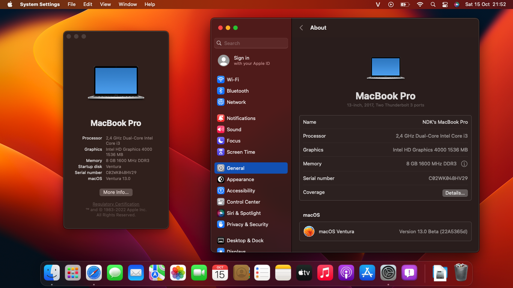
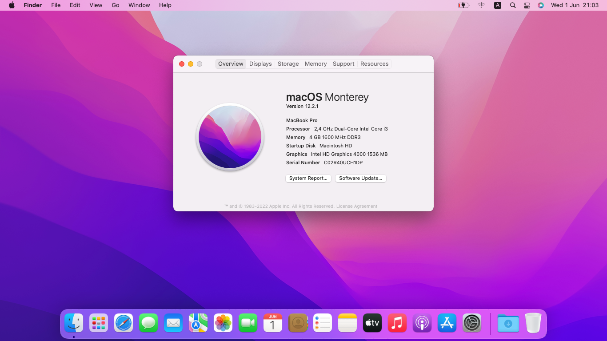

# <div align="center">Dell Vostro 3460 Hackintosh</div> 

## ```Note```

<h5>- Nếu bạn là người Việt Nam, hãy đọc <a href="https://github.com/qilskcter/Dell-Vostro-3460-Hackintosh/blob/main/README-VN.md">bản Tiếng Việt 🇻🇳</a></h5> 

## Bootloader Versions

|OpenCore|Clover|
|--------|------|
|0.8.4|5146| 

## Supported macOS Versions
- Sierra
- High Sierra
- Mojave
- Catalina (Use SMBIOS ```MacBookPro10,2```)
- Big Sur (Use SMBIOS ```MacBookPro11,1```)
- Monterey (Use SMBIOS ```MacBookPro12,1```)
- Ventura (OpenCore only)

```Note:``` When install macOS Ventura, using [CryptexFixup](https://github.com/acidanthera/CryptexFixup/releases/tag/1.0.0) to bypass AVX2.0 sytem requirement and use OpenCore Legacy Patcher Alpha 0.5.0 to fix iGPU and use ```MacBookPro14,1``` SMBIOS.

## Screenshots

<div align="center">
  

   
</div>
<details>
		<summary>Other OSes</summary>
      <br>
 



  
</details>

## Laptop Specification
 
|                     | Specifications| Note |
| ---------------------------- | ---------------------- |------------------|
| ``Chipset``| Intel Panther Point |   |
| ``CPU``| Intel Core i3-3110M 2.40GHz | Use [HFSPlusLegacy.efi](https://github.com/acidanthera/OcBinaryData/blob/master/Drivers/HfsPlusLegacy.efi) |
| ``Memory``| 8GB DDR3-1600MHz | 2 x 4GB DDR3 and DDR3L. |
| ``iGPU``| Intel HD Graphics 4000 | Patch with [Patch-HD4000-Monterey](https://github.com/chris1111/Patch-HD4000-Monterey) by [chris1111](https://github.com/chris1111) in Monterey. |
| ``dGPU``| NVIDIA GeForce GT 630M | Only at i5-3210M version. |
| ``Disk 0``| SSD Silicon Power Ace A55 512GB | Dualbooting Windows and macOS. |
| ``Disk 1``| HDD HGST HTS725050A7E630 500GB | Data saving. |
| ``Card Reader``| Realtek RTS5129 | Use [RealtekCardReader](https://github.com/0xFireWolf/RealtekCardReader/releases/tag/v0.9.6). |
| ``Fingerprint`` | Synaptics FP Sensors | Not working in macOS, disable in BIOS. |
| ``Screen``| 14.0" 1366 x 768 |    |
| ``Ethernet``| Qualcomm Atheros AR8161 | Use [AtherosE2200Ethernet](https://github.com/Mieze/AtherosE2200Ethernet/releases/tag/2.2.2). |
| ``WiFi and Bluetooth``| Intel® Dual Band Wireless-AC 7260 | (Replace from AR9485) Use [AirportItlwm](https://github.com/OpenIntelWireless/itlwm/releases) for Wifi and [IntelBluetoothFirmware](https://openintelwireless.github.io/IntelBluetoothFirmware/) for Bluetooth. | 
| ``Audio``| Conexant Cx20590 | Add `alcid=14` to boot-arg or add layout-id to DeviceProperties. |
| ``Keyboard``| - | Requied patching SSDT for brightness key. |
| ``Touchpad``| Dell Touchpad (ALPS, PS/2) | Use [VoodooPS2-ALPS](https://github.com/SkyrilHD/VoodooPS2-ALPS/releases/tag/1.0.7). |
| ``Battery``| 60Wh 6-cell lithium ion | |
| ``Dimensions``| 30mm x 345.5mm x 244mm |     |
|``Weight``| 2.23kg |     |
  
<div align="center">
  

  
</div>

## Features


|                               | OpenCore             | Clover|
| ----------------------------- | -------------------- | ------------------|
| ``Wifi and Bluetooth``|✅|✅|
| ``Audio``|✅|✅|
| ``Keyboard and Trackpad``|✅|✅|
| ``Headphone Jack``|✅|✅|
| ``Graphics``|✅|✅|
| ``Battery``|✅|✅|
| ``Card Reader``|✅|✅|
| ``Power Management``|✅|✅|
| ``Multigesture Trackpad``|✅|✅|                                                                          
| ``Webcam``|✅|✅|
| ``USB Port``|✅|✅|
| ``Facetime and iMessage``|✅|✅|
| ``Sleep``|✅|✅|
| ``Ethernet``|✅|✅|
| ``Hotkeys``|✅|✅|

# Boot Arguments
- When Install:

Using this Boot-args: ```-v keepsyms=1 debug=0x100```

- After Installation:

```revpatch=memtab``` Enable Memory tab in About this Mac when using MacbookPro10,2 SMBIOS with [RestrictEvents](https://github.com/acidanthera/RestrictEvents) kext.

# To change CPU Name (OpenCore only) 
- Go to ```NVRAM``` > ```4D1FDA02-38C7-4A6A-9CC6-4BCCA8B30102``` and add:

|Key|Type|Value|
|---|----|-----|
|revpatch|String|cpuname|
|revcpu|Number|1|
|revcpuname|String| ``Your CPU Name`` |

- Go to ```PlatformInfo``` > ```Generic``` and change ```ProcessorType``` value from 0 to 1537.

# Post-Install
After installation, open System Preferences and go to Displays -> Color, uncheck `Show profiles for this display only`, then select `sRGB IEC61966-2.1`, this will make your colors look right (definitely not calibrated or anything but yeah, not an oversaturated mess)

<div align="center">
  


</div>

If you want your Display like RealMac, you can use [one-key-hidpi](https://github.com/xzhih/one-key-hidpi) (not recommended)

<div align="center">
  

  
</div>

# How To Use This EFI ?
You download the macOS installer from [HeaVietNam](https://heavietnam.github.io/image/index.html) (although the online recovery method is still better), then use MiniTool or other software to mount the EFI partition, then use Explorer++ to access the EFI partition and copy it to your EFI folder. Remember to add the entry to your firmware afterwards, using [EasyUEFI](https://www.easyuefi.com/index-us.html) or your firmware's built-in boot configurator.
# Thanks
- [Apple](https://apple.com) for macOS.
- Acidanthera, SkyrilHD, USBToolBox, etc. for all the kext.
- [NLTD2010](https://github.com/NLTD2010) and [Olarila](https://olarila.com) for my EFI folders.
- [khanhmuy](https://github.com/khanhmuy) for my README file.
- [Võ Nguyễn HoangLong](https://www.facebook.com/profile.php?id=100070274020733) for [HeaVietNam](http://heavietnam.ga/) guide.
- [Stijn Rombouts](https://www.facebook.com/stijn.rombouts2) for help me fixed something.
- [kleqing](https://github.com/kleqing) for help me fixed sleep in Monterey.
