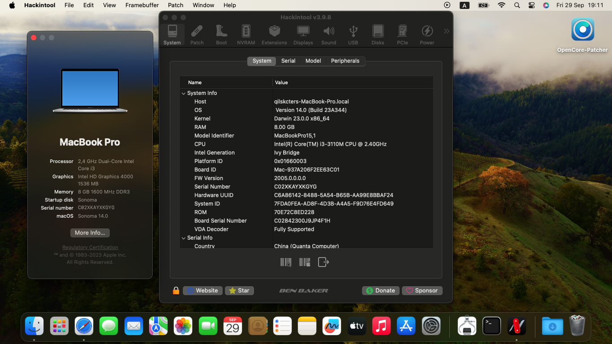
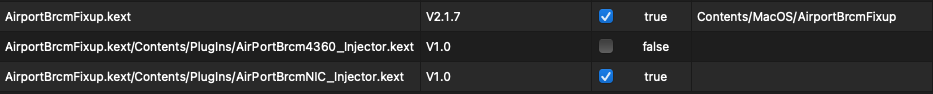
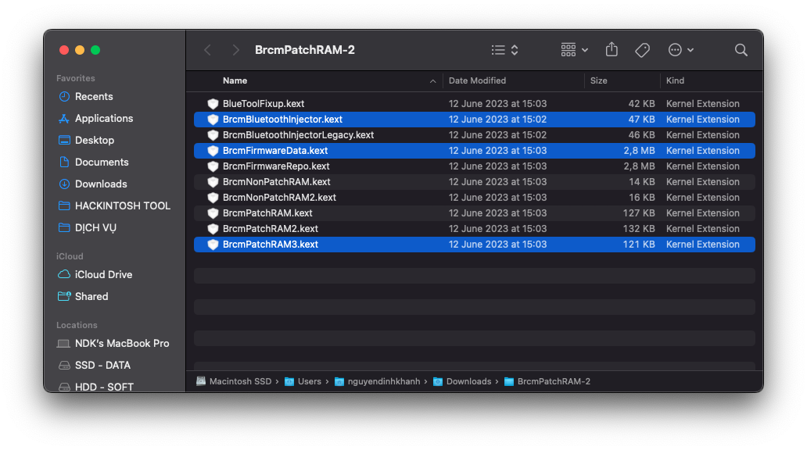
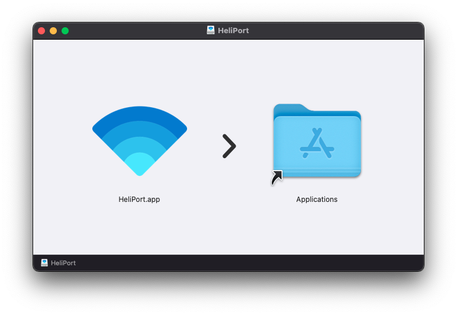

# Dell Vostro 3460 Hackintosh

[English](README.md) | [Tiếng Việt](README_vi.md) | [中国人](README_ch.md)

## 版本

### 引导程序

|OpenCore|Clover|
|--------|------|
|0.9.6|5146| 

### macOS

|版本|SMBios|
|-------|------|
|High Siera 
Mojave  
Catalina | ```MacBookPro9,2``` |
|Big Sur| ```MacBookPro11,1``` |
|Monterey| ```MacBookPro12,1``` |
|Ventura| ```MacBookPro14,1``` |
|Sonoma| ```MacBookPro15,1``` |

```注意:``` 
- 安装 macOS Ventura 和 Sonoma 时, 使用 [CryptexFixup](https://github.com/acidanthera/CryptexFixup/releases) 绕过 AVX2.0 系统要求.


## 截屏

<div align="center">
  

   
</div>


## 笔记本配置
 
|                     | Specifications|
| ---------------------------- | ---------------------- |
| ``芯片组``| Intel Panther Point |
| ``处理器``| Intel Core i3-3110M / i5-3210M / i7-3612QM | 
| ``内存``| 8GB DDR3-1600MHz |
| ``集成显卡``| Intel HD Graphics 4000 | 
| ``独立显卡``| NVIDIA GeForce GT 630M | 
| ``存储``| 2,5" SATA DISK | 
| ``读卡器``| Realtek RTS5129 | 
| ``指纹识别`` | Synaptics FP Sensors |
| ``屏幕``| 14.0" 1366 x 768 |
| ``以太网``| Qualcomm Atheros AR8161 |
| ``无线网卡和蓝牙``| Intel® Dual Band Wireless-AC 7260 <br> Broadcom BCM94352HMB |
| ``声卡``| Conexant Cx20590 | 
| ``键盘``| - | 
| ``触摸板``| Dell Touchpad (ALPS, PS/2) |
| ``电池``| 48Wh 6-cell lithium ion |
| ``尺寸``| 30mm x 345.5mm x 244mm |
| ``重量``| 2.23kg |
  
## 哪些正常工作

- [x] 无线网络和蓝牙
- [x] 音频
- [x] 键盘和触摸板
- [x] 耳机插口
- [x] 显卡
- [x] 电池
- [x] 读卡器
- [x] 电源管理
- [x] 多手势触摸板  
- [x] 摄像头
- [x] USB接口
- [x] Facetime和 iMessage
- [x] 睡眠
- [x] 以太网
- [x] 热键

# 安装
## 下载 macOS 安装程序
### 离线安装
- 从[Olarila]下载安装 [Olarila](https://www.olarila.com/topic/6278-olarila-vanilla-images-macos-installer/), 之后, 用 [Balena Etcher](https://etcher.balena.io) 将.raw 文件闪存到你的U盘中。
- 使用 [MiniTool](https://www.partitionwizard.com) 挂载 USB的EFI 分区。
- 使用 [Explorer++](https://explorerplusplus.com/download) 访问 EFI 分区。
- 下载我的EFI在[发布页面](https://github.com/qilskcter/Dell-Vostro-3460-Hackintosh/releases), 并将其复制到 EFI 分区。
### Online Recovery
- 按照 [Dortania的 OpenCore安装指南](https://dortania.github.io/OpenCore-Install-Guide/installer-guide/windows-install.html) 创建 macOS Recovery.
-下载我的EFI在[发布页面] (https://github.com/qilskcter/Dell-Vostro-3460-Hackintosh/releases),并将其复制到你的U盘。
# 安装之后
## 修复无线网络和蓝牙
### 博通
``Wifi``
- 下载 [AirportBrcmFiup](https://github.com/acidanthera/AirportBrcmFixup/releases) 并将 ``AirportBrcmFixup.kext`` 复制到 ```\EFI\OC\Kext文件夹中``` (记住将其添加到 config.plist文件中) 或者复制到```\EFI\CLOVER\Kext\Other文件夹中```.
-  重启电脑。

```注意: ```
- 在macOS Big Sur及更高版本中使用AirportBrcmFixup时, 你需要删除```AirPortBrcm4360_Injector``` kext 插件



``Bluetooth``

- 下载 [BrcmPatchRAM](https://github.com/acidanthera/BrcmPatchRAM/releases).
-在你的 macOS版本中使用这些kexts并复制它 

``` Monterey 和 Ventura ```


``` Catalina 和 Big Sur ```



```High Sierra 和 Mojave```


### Intel
``Wifi``

```使用 Itlwm```
- 下载 [Itlwm](https://github.com/OpenIntelWireless/itlwm/releases) 和 [HeliPort](https://github.com/OpenIntelWireless/HeliPort/releases), 拷贝 ``Itlwm.kext`` 到 ```\EFI\OC\Kext``` (记得将其添加到config.plist中) 或 ```\EFI\CLOVER\Kext\Other```.
- 重新启动系统并安装 HeliPort.app 以通过拖放到应用程序文件夹中来访问网络。



```使用AirportItlwm```

- 下载 [AirportItlwm](https://github.com/OpenIntelWireless/itlwm/releases), 拷贝 ``AirportItlwm.kext`` 到 ```\EFI\OC\Kext``` (记得将其添加到config.plist中)或 ```\EFI\CLOVER\Kext\Other```.
-重启电脑。

``Bluetooth``

```Monterey 和 Ventura```

- 下载 [BrcmPatchRAM](https://github.com/acidanthera/BrcmPatchRAM/releases) 和 [IntelBluetoothFirmware](https://github.com/OpenIntelWireless/IntelBluetoothFirmware/releases).
- 在BrcmPatchRAM 文件夹中，仅使用 ``BluetoolFixup.kext`` 并复制到 ```\EFI\OC\Kext``` (记住将其添加到config.plist中) 或 ```\EFI\CLOVER\Kext\Other```.
- 在 IntelBluetoothFirmware 文件夹中, 删除 ``IntelBluetoothFirmwareInjector.kext`` 并复制到 ```\EFI\OC\Kext``` (记得将其添加到config.plist中) 或 ```\EFI\CLOVER\Kext\Other```.

```大苏尔及更老的版本```

- 下载 [IntelBluetoothFirmware](https://github.com/OpenIntelWireless/IntelBluetoothFirmware/releases) 并将里面的所有 kext 复制到 ```\EFI\OC\Kext``` (记住将其添加到config.plist中) 或 ```\EFI\CLOVER\Kext\Other```.

# 谢谢
- [Apple](https://apple.com) 提供的 macOS.
- Acidanthera, SkyrilHD, USBToolBox, etc. 提供的驱动程序。
- [NLTD2010](https://github.com/NLTD2010) and [Olarila](https://olarila.com) 帮助我完成EFI文件。
- [khanhmuy](https://github.com/khanhmuy) 帮助我完成自述文件。
- [Võ Nguyễn HoangLong](https://www.facebook.com/profile.php?id=100070274020733)。
- [Stijn Rombouts](https://www.facebook.com/stijn.rombouts2) 帮助我修复了一些问题。
- [kleqing](https://github.com/kleqing) 在Monterey版本帮助我修复睡眠问题。
- [Jishe Zhang](https://www.facebook.com/zhang.jishe) 帮我翻译成中文。
