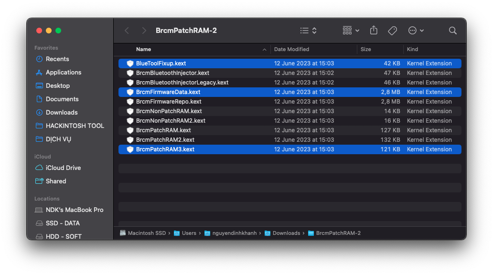

# Dell Vostro 3460 Hackintosh

[English](README.md) | [Tiếng Việt](README_vi.md) | [中国人](README_ch.md)

## Phiên bản

### Bootloader

|OpenCore|Clover|
|--------|------|
|0.9.6|5146| 

### macOS

|Phiên bản|SMBios|
|-------|------|
|High Siera 
Mojave  
Catalina | ```MacBookPro9,2``` |
|Big Sur| ```MacBookPro11,1``` |
|Monterey| ```MacBookPro12,1``` |
|Ventura| ```MacBookPro14,1``` |
|Sonoma| ```MacBookPro15,1``` |

```Note:``` 
- Khi cài đặt macOS Ventura và Sonoma, hãy dùng kext [CryptexFixup](https://github.com/acidanthera/CryptexFixup/releases) để vượt qua yêu cầu AVX2.0 đối với CPU.


## Ảnh chụp màn hình

<div align="center">
  

   
</div>


## Thông tin máy
 
|                     | Specifications|
| ---------------------------- | ---------------------- |
| ``Chipset``| Intel Panther Point |
| ``CPU``| Intel Core i3-3110M / i5-3210M / i7-3612QM | 
| ``RAM``| 8GB DDR3-1600MHz |
| ``iGPU``| Intel HD Graphics 4000 | 
| ``dGPU``| NVIDIA GeForce GT 630M | 
| ``Ổ cứng``| 2,5" chuẩn SATA 3| 
| ``Đầu đọc thẻ``| Realtek RTS5129 | 
| ``Vân tay`` | Synaptics FP Sensors |
| ``Màn hình``| 14.0" 1366 x 768 |
| ``Ethernet``| Qualcomm Atheros AR8161 |
| ``WiFi và Bluetooth``| Intel® Dual Band Wireless-AC 7260 <br> Broadcom BCM94352HMB |
| ``Âm thanh``| Conexant Cx20590 | 
| ``Bàn phím``| - | 
| ``Touchpad``| Dell Touchpad (ALPS, PS/2) |
| ``Pin``| 48Wh 6-cell lithium ion |
| ``Kích thước``| 30mm x 345.5mm x 244mm |
| ``Cân nặng``| 2.23kg |
  
## Hoạt động ?

- [x] Wifi và Bluetooth
- [x] Âm thanh
- [x] Bàn phím và Trackpad
- [x] Jack 5 củ <(")
- [x] Card đồ họa
- [x] Pin
- [x] Đầu đọc thẻ
- [x] Quản lý năng lượng
- [x] Trackpad đa điểm
- [x] Webcam
- [x] Cổng USB
- [x] Facetime và iMessage
- [x] Sleep
- [x] Ethernet
- [x] Phím nóng

# Cài đặt
## Tải bộ cài macOS
### Cài Offline
- Tải bộ cài macOS tại [Olarila](https://www.olarila.com/topic/6278-olarila-vanilla-images-macos-installer/), sau đó sử dụng [Balena Etcher](https://etcher.balena.io) để tạo usb.
- Sử dụng [MiniTool](https://www.partitionwizard.com) để mount phân vùng EFI.
- Sử dụng [Explorer++](https://explorerplusplus.com/download) để truy cập phân vùng EFI.
- Tải EFI ở  [Release](https://github.com/qilskcter/Dell-Vostro-3460-Hackintosh/releases), và sao chép vào phân vùng EFI trên USB.
### Cài Online
- Làm theo [OpenCore Install Guide của Dortania](https://dortania.github.io/OpenCore-Install-Guide/installer-guide/windows-install.html) để tạo macOS Recovery.
- Tải EFI ở  [Release](https://github.com/qilskcter/Dell-Vostro-3460-Hackintosh/releases), và sao chép vào phân vùng EFI trên USB.
# Sau cài đặt
## Fixing Wifi và Bluetooth
### Broadcom
``Wifi``
- Tải [AirportBrcmFixup](https://github.com/acidanthera/AirportBrcmFixup/releases) và sao chép ``AirportBrcmFixup.kext`` vào ```\EFI\OC\Kext``` (Nhớ thêm nó vào trong config.plist) hoặc ```\EFI\CLOVER\Kext\Other```.
-  Khởi động lại và tận hưởng.

```Note: ```
- Khi sử dụng AirportBrcmFixup trên Big Sur trở lên, bạn hãy xóa plugin ```AirPortBrcm4360_Injector```.


``Bluetooth``

- Tải [BrcmPatchRAM](https://github.com/acidanthera/BrcmPatchRAM/releases).
- Sử dụng những kext trên dựa theo macOS của bạn.

```Monterey và Ventura```



```Catalina và Big Sur```


```High Sierra và Mojave```


### Intel
``Wifi``

```Sử dụng Itlwm```
- Tải [Itlwm](https://github.com/OpenIntelWireless/itlwm/releases) và [HeliPort](https://github.com/OpenIntelWireless/HeliPort/releases), sao chép ``Itlwm.kext`` vào ```\EFI\OC\Kext``` (Nhớ thêm nó vào trong config.plist) hoặc ```\EFI\CLOVER\Kext\Other```.
- Khởi động lại máy và cài đặt HeliPort.app để sử dụng mạng.


```Sử dụng AirportItlwm```

- Tải [AirportItlwm](https://github.com/OpenIntelWireless/itlwm/releases), sao chép ``AirportItlwm.kext`` vào ```\EFI\OC\Kext``` (Nhớ thêm nó vào trong config.plist) or ```\EFI\CLOVER\Kext\Other```.
- Khởi động lại và tận hưởng.

``Bluetooth``

```Monterey and Ventura```

- Tải [BrcmPatchRAM](https://github.com/acidanthera/BrcmPatchRAM/releases) and [IntelBluetoothFirmware](https://github.com/OpenIntelWireless/IntelBluetoothFirmware/releases).
- Trong thư mục BrcmPatchRAM, chỉ sử dụng ``BluetoolFixup.kext`` và sao chép vào ```\EFI\OC\Kext``` (Nhớ thêm nó vào trong config.plist) hoặc ```\EFI\CLOVER\Kext\Other```.
- Trong thư mục IntelBluetoothFirmware, xóa ``IntelBluetoothFirmwareInjector.kext`` và sao chép vào ```\EFI\OC\Kext``` (Nhớ thêm nó vào trong config.plist) hoặc ```\EFI\CLOVER\Kext\Other```.

```Big Sur và cũ hơn```

- Tải [IntelBluetoothFirmware](https://github.com/OpenIntelWireless/IntelBluetoothFirmware/releases) và sao chép tất cả các kext trong đó vào ```\EFI\OC\Kext``` (Nhớ thêm nó vào trong config.plist) hoặc ```\EFI\CLOVER\Kext\Other```.


# Cảm ơn
- [Apple](https://apple.com) vì macOS.
- Acidanthera, SkyrilHD, USBToolBox, etc. cho tất cả những kext tôi dùng.
- [NLTD2010](https://github.com/NLTD2010) và [Olarila](https://olarila.com) cho thư mục EFI của tôi.
- [khanhmuy](https://github.com/khanhmuy) cho file README này.
- [Võ Nguyễn HoangLong](https://www.facebook.com/profile.php?id=100070274020733).
- [Stijn Rombouts](https://www.facebook.com/stijn.rombouts2) vì đã giúp tôi sửa lỗi một số thứ.
- [kleqing](https://github.com/kleqing) đã giúp tôi fix các vấn đề về sleep trên Monterey.
